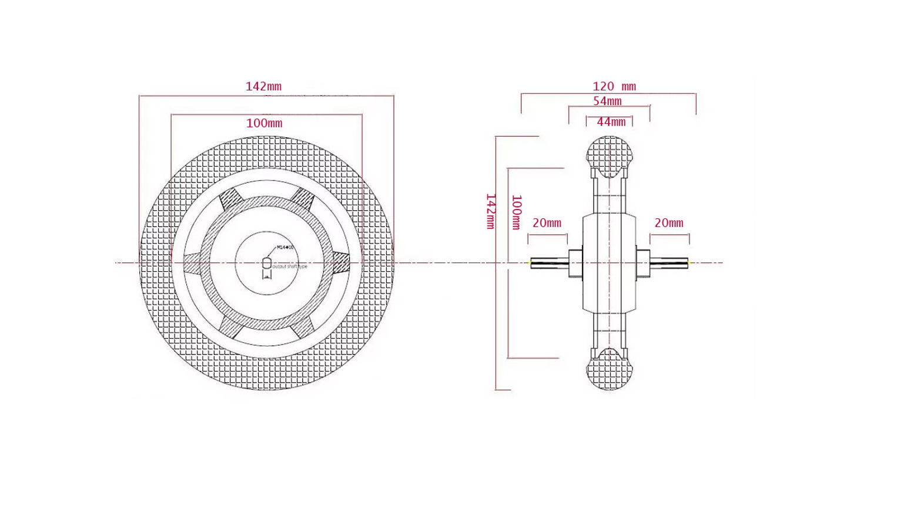
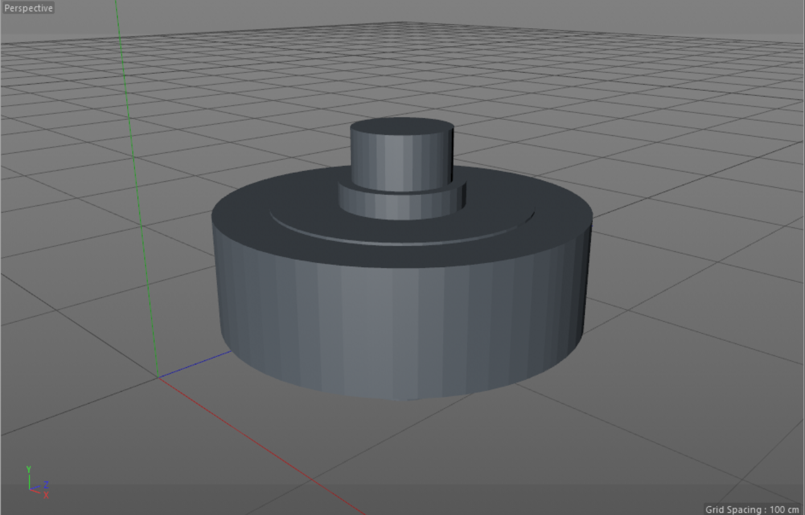
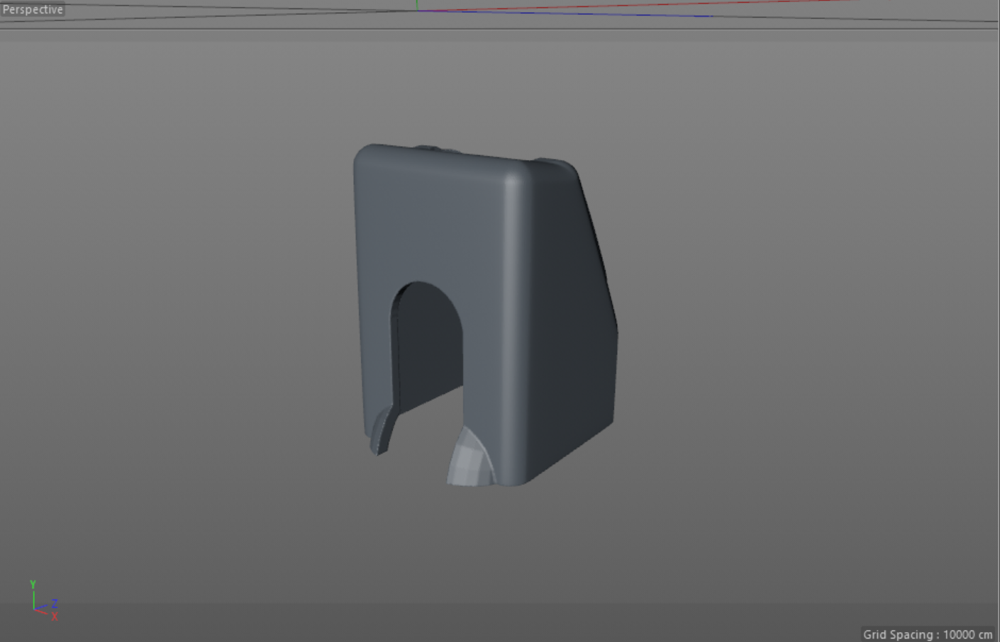
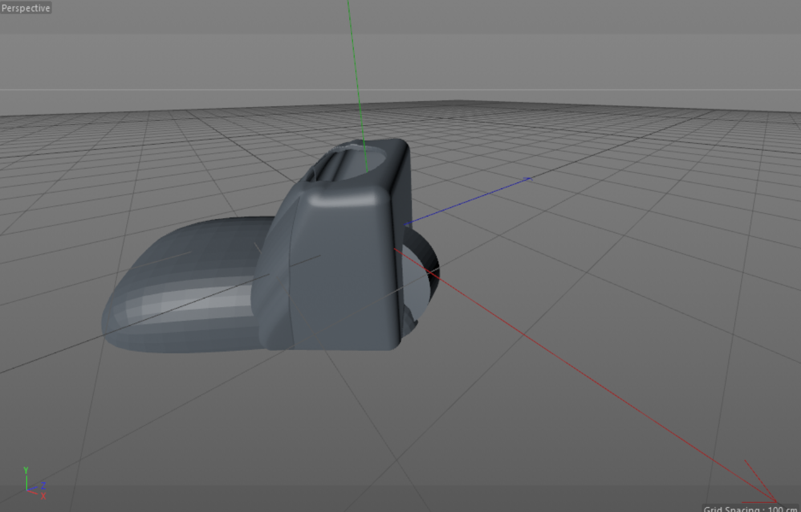

## Robot-Wheels⚒: 

**In order to design a perfect robot, you will need lots of components one of them is the Robot Wheels.Wheeled robots are robots that navigate around the ground using motorized wheels to propel themselves. This design is simpler than using treads or legs and by using wheels they are easier to design, build, and program for movement. Because of wheels robots are easily controlled, spin on the spot, or turn around in small places and they help in steering compared to tracks** 
## Dimensions Graph📈  
  
## Wheel Specifications⚙️ 
There are a number of different specifications you need to consider when choosing wheels for your robot. Three of the key ones are as follows:
### Wheel Size
The size of the wheel is an obvious parameter to consider, and it can affect the design of many elements of your robot.
### Wheel Width
The width of the wheel can affect the steering, especially when using skid steering. Skid steering is when you steer the robot by altering the speed of its wheels, DB1 uses this technique as do most hobbyist robots due to its simplicity.
### Wheel Tread
 The tread can affect what surfaces the robot can be used on
 ## Add Wheels 
 Now we're going to put the wheel inside the foot, before we do this we have to cut the back of piece number 7 so we can insert the wheel.
## Wheel View⚙️
    
  
 
## piece number 7 After cut the back✂️  
    
    
 ## Final view🔍  
     
